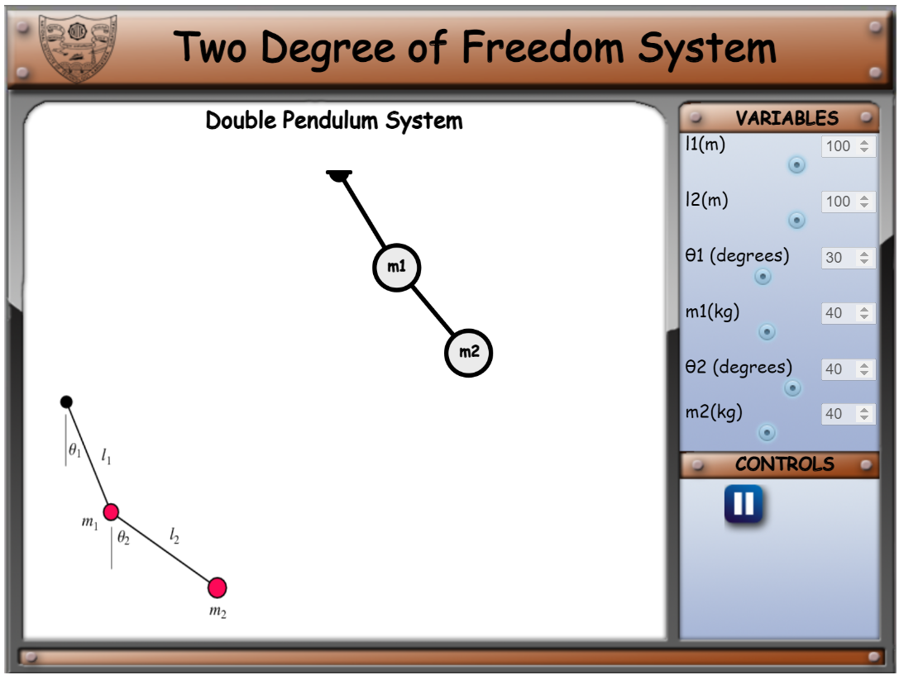
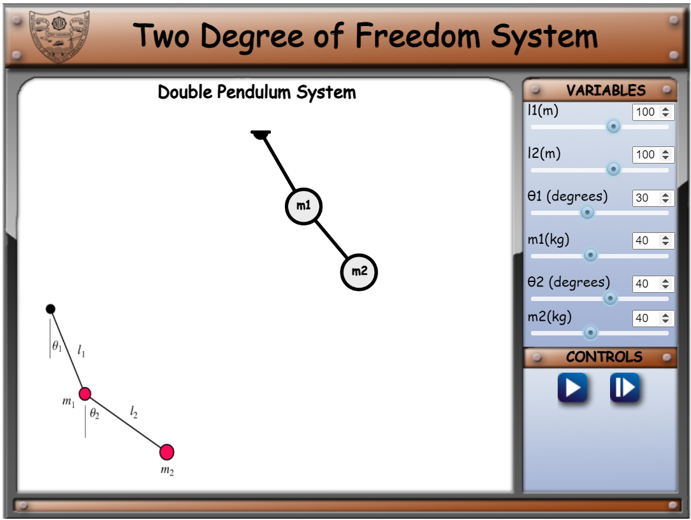
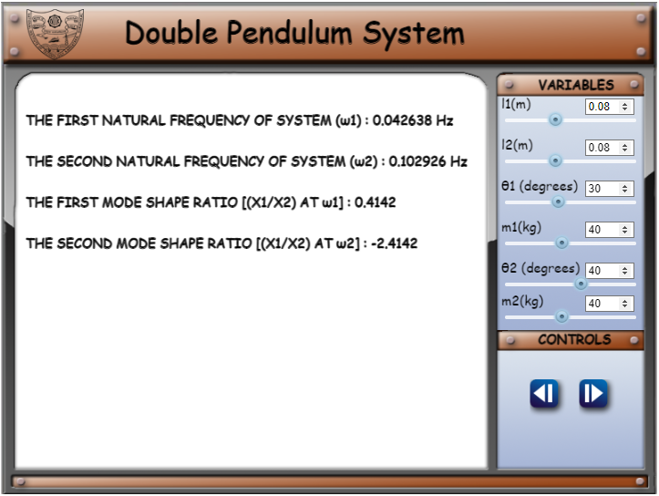
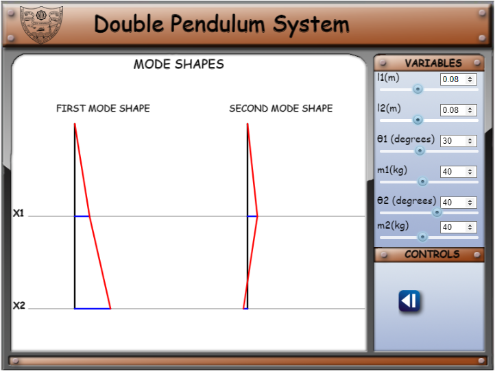

1.	At first page, the animation of double pendulum is displayed as shown below:

2.	The schematic representation of double pendulum is given as to denote the identity of each variable in variables toolbox.

3.	To change the values of the variables or to go to next page, click    button.

4.	To play the animation, click   button.

5.	You can change the variables (l1, l2, θ1, θ2, m1, and m2) and conclude your inference according to your convenience.

6.	To go to next page, click   button.

7.	At the second page, you will check the two natural frequencies of system and their respective mode shape ratios.

8.	At third page, you will check the mode shapes of the point masses with respect to their mode shape ratio and natural frequencies.

9.	You can change the values of variables in any of the page only if you pause the animation.

10.	To go back to the previous page, click     button.
