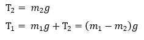
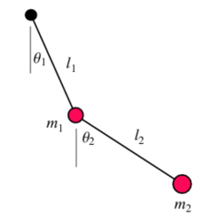
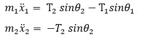

A double pendulum system as shown in Fig 1, consists of two-point masses m1 and m2 suspended by strings of length l1 and l2 as shown below. Let the system vibrates in vertical plane with small amplitudes, under which conditions the masses may be considered to have only horizontal motion. Let θ1 and θ2 be the angles the strings at any instant make with vertical and let x1 and x2 be the horizontal displacements of the two masses, such that the following relationships holds good for small amplitudes.

For finding natural frequency and mode shapes:
Considering no motion in vertical direction, the vertical components of forces on each of two masses must balance. Therefore,

Fig 1. Repesentation of variables in the double pendulum

Fig 2. Free body diagram of the double pendulum

Writing down the equation of motion of two masses for motion in horizontal direction from Fig 2, we have

If we take T1 and T2 values in the above equation, we get

Assuming the general solution of equation of motion to be:

Substituting the above solutions with the equation of motion, we get

This equation will give,

Equating the two expressions in the above two equations and cross multiplying.

If E = (m2 x g)/l2 and F = (m1+m2)g/l1 , then the frequency equation is

The above equation is quadratic in &omega;2 and gives two values of &omega;2, and therefore two positive values of &omega; corresponding to two natural frequencies &omega;n1 and &omega;n2 of the system. The above equation is called the frequency equation since the roots of this equation gives the natural frequencies of the system.
Considering,

 
The above equations become,

which gives,

or

which is the frequency equation.

Solving for &omega;, using quadratic equation we have the two values of the natural frequencies as,

The amplitude ratio of the equations are:

If in either of the equations, on substituting for &omega; the value of &omega;n1, we have the first mode shape of the system i.e., when the system is vibrating with the first natural frequency &omega;n1, the mode shape is such that the ratio of the amplitude of two masses is equal to the solution of above equation.

Similarly, in either of the equations, substituting for &omega; the value of &omega;n2, we have the second mode shape of the system i.e., when the system is vibrating with the second natural frequency &omega;n2, the mode shape is such that the ratio of the amplitude of two masses is equal to the solution of above equation.

For calculating the motion of point masses:

The cartesian co-ordinates of two-point masses in a double pendulum are,

On solving the equations of motion in polar coordinates and we are going to use the Lagrangian method (L=T-V where T is kinetic energy of system and V is potential energy of system) to derive them. 

The kinetic energy of the system:

The potential energy of system:

The Lagrange equations for &theta;1 and &theta;2 are,

On solving,

Where &mu; = 1 + (m1 + m2), $\ddot θ1$ and $\ddot θ2$ are angular accelerations of point masses m1 and m2 and $\dot θ1$ and $\dot θ2$ are angular velocities of point masses m1 and m2.

To solve the equation of motion for the angles, we can use the Euler method. For using Euler method, we should define a time interval and iterate over time. As time changes, angular acceleration, angular velocity and angle is changed. So, from the values of angular acceleration, velocity and angle at that instant of time, we can calculate the position of the system precisely. 
Such that,

